# きゅぴきゅぴ Frontend

## Getting Started

1. Make sure you run backend docker successfully.

2. Install pnpm if you haven't

```bash
npm install -g pnpm
```

Reference: https://pnpm.io/installation

3. Launch

```bash
cp .env.local.example .env.local
make dev
```

3. Tada 🚀

Open [http://localhost:5174](http://localhost:5174) with your browser to see the result.

## Gitflow

```mermaid
flowchart LR

subgraph Designer [Linh - Designer]
D[design]
end

subgraph Developer [Tuấn - Developer]
F[feature/*]
DEV[develop]
MAIN[main]
end

D --> DEV
F --> DEV
DEV --> MAIN
```




